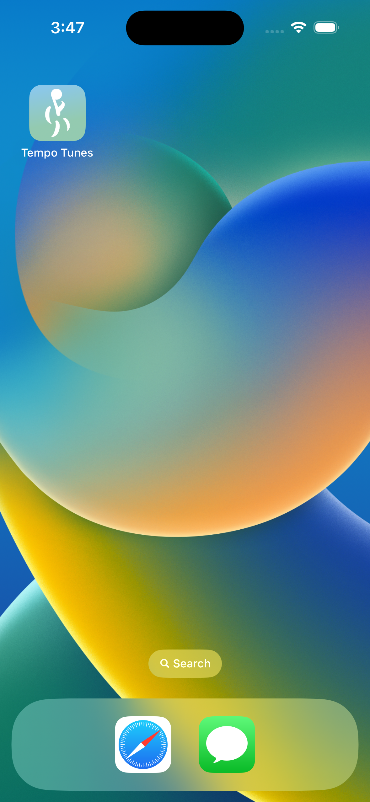
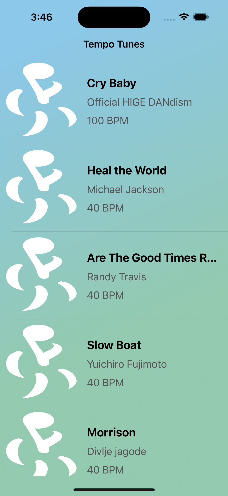
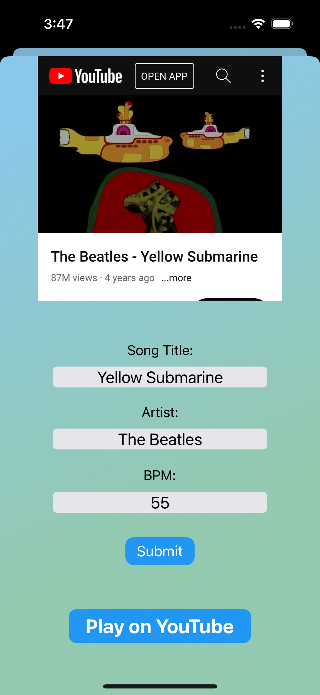
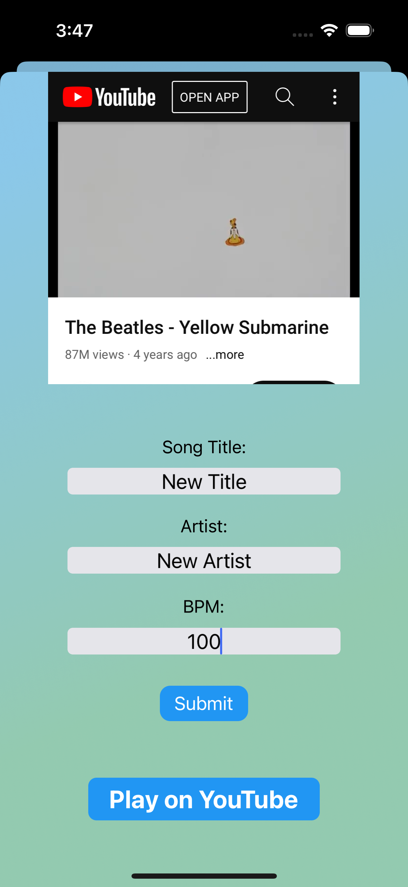
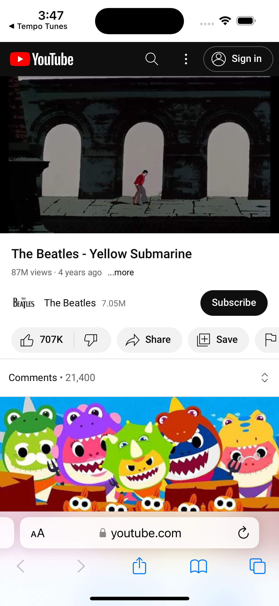
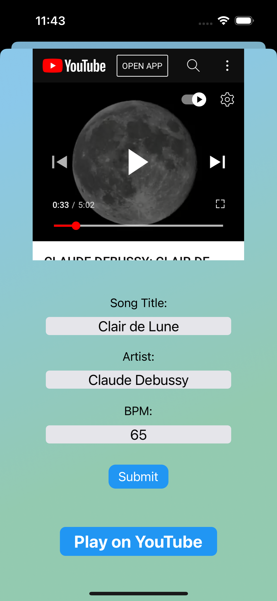

# Tempo Tunes

### A music player with beats based on BPM
Backend repo: https://github.com/gnd23/hack-challenge-2022 
Design Figma: https://www.figma.com/file/eX6xuAbHMMrAWuyUsyzZ1j/Hack-challenge-katherine-chang?node-id=31:408 
Video demo: https://youtu.be/ODjAbjHQ_Oo

### Screenshots
         

### Features:
1. App with icon and display name
2. Loading song info from database
3. TableView to showcase songs
4. Separate ViewController with song details via delegate
5. YouTube playback using WKWebView
6. Delegate to change song title, artist, and BPM (this does not currently sync to the database)
7. Button to open YouTube video using URL

### Team members:
Gavin Nicholas Dutterer (Backend)\
Katherine Chang (Design)\
Allison Hui (iOS)\
Sam Friedman (iOS)

### Future features to implement:
- Loading and displaying album art
- Filtering songs by BPM
- Bottom navigation bar to move between screens
- Song changes added to database
- Add new songs
- Favorite songs and BPM's

#### Tempo Tunes is a collaborative app originally built for Cornell AppDev's iOS Hack Challange

© Sam Friedman 2024
